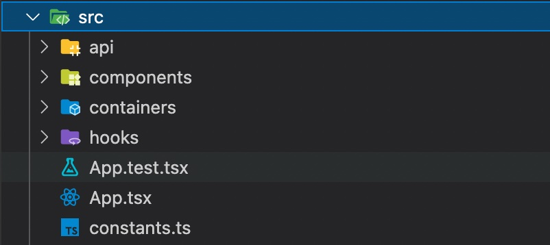

# About
Simple web app to check weather status in 5 day. Weather data is provided by https://www.metaweather.com .
## Structure

# Available Scripts

In the project directory, you can run:
### `yarn`
Install libraries  

### `yarn setup-dev`
Install tools for developments

### `yarn start`

Runs the app in the development mode.\
Open [http://localhost:3000](http://localhost:3000) to view it in the browser.

### `yarn test`

### `yarn cover`
Run test and report coverage

### `yarn build`

Builds the app for production to the `build` folder.
See the section about [deployment](https://facebook.github.io/create-react-app/docs/deployment) for more information.

### `yarn eject`

**Note: this is a one-way operation. Once you `eject`, you can’t go back!**
